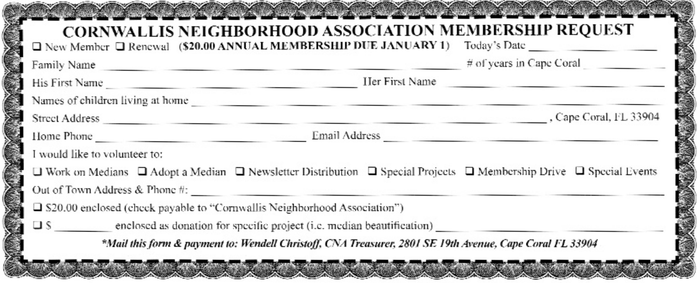

Cornwallis Neighborhood Association (CNA) was formed in 1994. Our main purpose was focused to and for the continuous improvement, enhancement, beautification safety, and enjoyment of our neighborhood and all its astounding surroundings. Over the years we have beautified our medians, purchased, and maintain our unique entrance monument along with the flagpole, introduced lights on median 1 and helped residents with their respective cul-de-sac median maintenance. Additionally, we operate as needed as a neighborhood advocacy group relative to maintaining water quality, Environmental health & safety, or other specific matters as they arise.

# Membership

Membership dues are currently $20.00 per year.

* Entrance Monument maintenance, repair & replacement
* Website Costs
* Printing & Distribution Costs (remove the following- of our Newsletter to all residents of the Cornwallis neighborhood 4 x year)
* Advertisement and sign cost (for neighborhood activities & events)
* Annual Block Party
* Annual Christmas Party
* New members Gift Bag
* Legal representation as necessary specific to CNA protecting and maintaining our neighborhood and or community interests.
* Median Maintenance & beautification (grass, shrubs, tress, plants, palms, benches, library)
* Purchase of benches/signs/garbage cans for medians

## To join, fill out the following form (or use the printable at the bottom)

<iframe src="https://docs.google.com/forms/d/e/1FAIpQLSeP5TWXYzh1mgieIZEEx3GMoP9vil9jlXYSzDJ4UURMPgwK2g/viewform?embedded=true" width="820" height="3800" frameborder="0" marginheight="0" marginwidth="0">Loading…</iframe>

<!--
## You can now send your membership renewal with [Zelle(c)](https://www.zellepay.com/how-it-works)

Zelle is an online person-to-person, person-to-business payment service.  Your bank likely already supports Zelle from your banking dashboard.  For example,
    at Chase, you can login and go to your <b>Pay & Transfer</b> menu entry and select <b>Payment Center</b>.  You should see a screen like [Chase dashboard for Zelle](images/zelle-at-chase.png).   From there you can enroll in Zelle and add a new recipient of <b>{{site.owner.email}}</b>.  Your payment via Zelle will automatically send a notification to the board along with your membership contribution to the CNA account.   You can also download the [Getting started with Zelle](https://www.zellepay.com/go/zelle) app for your iPhone or Android device.
-->

## Or you can print out this form and send it to us

<button onclick="printImg('/images/CNA_membership_request.png')">Print Membership Form</button>
